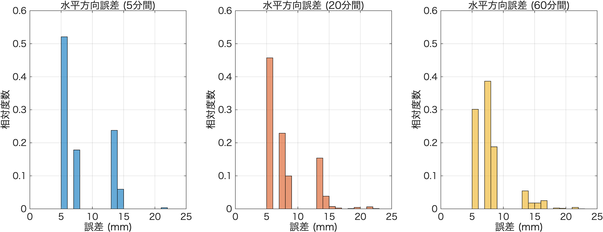
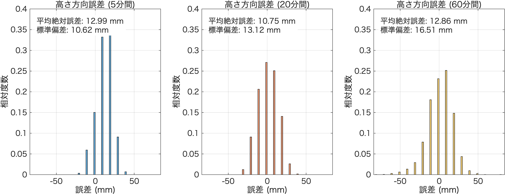

# RTK測位精度 評価レポート (水平・高さ)

全体（60分間）の平均座標を基準値（真値）とし、5分・20分・60分間の各データ区間について、水平方向（2D）と高さ方向（Up）の標準偏差と平均誤差を算出しました。

## 評価結果まとめ

| 計測時間 | 水平方向 平均誤差 | 水平方向 標準偏差 | 高さ方向 平均絶対誤差 | 高さ方向 標準偏差 |
| :--- | :--- | :--- | :--- | :--- |
| **5分** | 8.21 mm | 3.54 mm | 12.99 mm | 10.60 mm |
| **20分** | 8.06 mm | 3.35 mm | 10.75 mm | 13.12 mm |
| **60分** | 7.97 mm | 2.92 mm | 12.86 mm | 16.50 mm |

### 用語の解説
- **水平方向 平均誤差**: 各測位点の基準座標からの水平距離（2D誤差）の平均値です。
- **水平方向 標準偏差**: 水平誤差のバラツキの大きさを示します。
- **高さ方向 平均絶対誤差**: 基準となる高さからどれだけ上下にズレているか（絶対値）の平均値です。
- **高さ方向 標準偏差**: 高さのズレのバラツキ（不安定さ）を示します。GNSSの特性上、一般的に水平方向よりも大きくなります。

## 誤差分布のヒストグラム

以下のグラフは、各観測時間（5分・20分・60分）における誤差の分布（相対度数）を示しています。データの件数に依存せず純粋な形状を比較できるよう、縦軸は確率（相対度数）で統一し、グラフのスケールも揃えています。

### 水平方向誤差
この分布の平均値が上記の「水平方向 平均誤差」に相当します。

### 高さ方向誤差（符号付き）
高さ方向のズレ（上方向が正、下方向が負）の分布です。この分布の絶対値の平均が「高さ方向 平均絶対誤差」に相当します。

### 補足：データの分解能（ヒストグラムの形状）について
ヒストグラムの分布が滑らかな曲線ではなく、離散的な（隙間が空いたような）形状になっているのは、GNSS受信機から出力される**元データの分解能（ログの丸め精度）**に起因しています。

- **水平方向（緯度・経度）**: ログ出力が小数点以下7桁（度）となっており、距離換算で **約9〜11 mm間隔** の離散値となっています。
- **高さ方向（高度）**: ログ出力が小数点以下2桁（メートル）となっており、厳密に **10 mm間隔** の離散値となっています。

このように、データ自体が約1cm刻みのグリッド状に量子化されて記録されているため、グラフ上でも数ミリ単位の隙間が生じる結果となっています。これは分析手法の問題ではなく、機器の出力フォーマットによる正常な仕様です。
